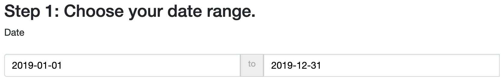
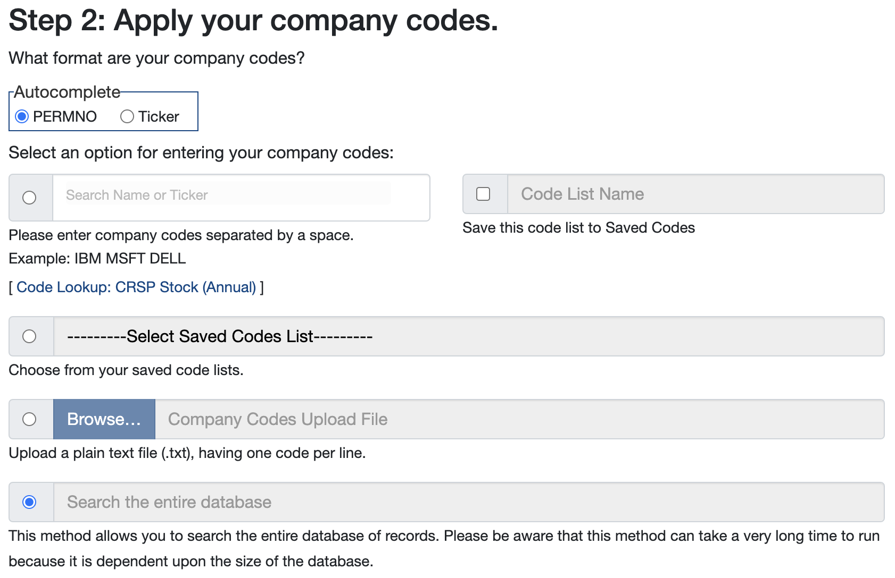
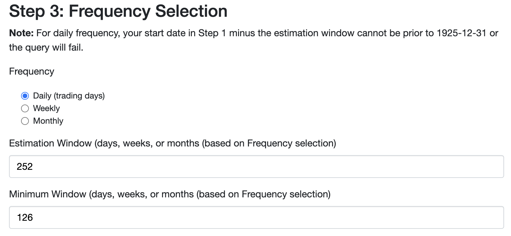
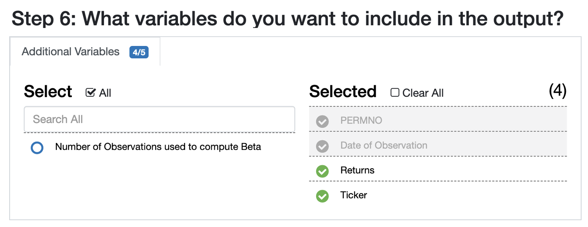
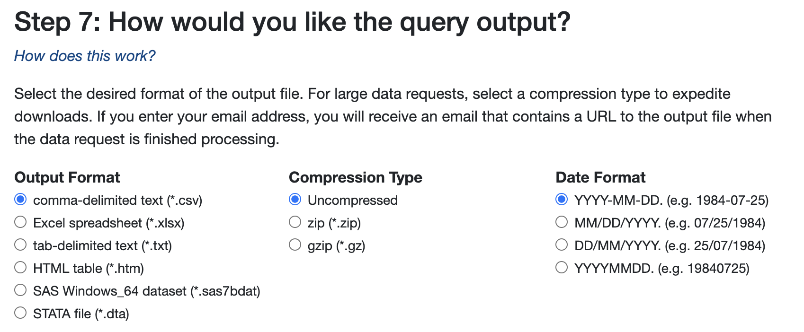

# Large Language Models: An Applied Econometric Framework

This repository contains the code, data, and outputs associated with the paper "[Large Language Models: An Applied Econometric Framework](https://arxiv.org/pdf/2412.07031)" by Jens Ludwig, Sendhil Mullainathan, and Ashesh Rambachan.

## Repository Structure

This repository is organized to facilitate the replication of results presented in the paper. The subdirectories are structured based on task type (**prediction** or **estimation**) and application (**financial news headlines** or **Congressional legislation**):
- `prediction_headlines/`: Code and data for prediction tasks involving financial news headlines.
- `prediction_legislation/`: Code and data for prediction tasks involving Congressional legislation.
- `estimation_headlines/`: Code and data for estimation tasks involving financial news headlines.
- `estimation_legislation/`: Code and data for estimation tasks involving Congressional legislation.
- `figures/`: Code and outputs for generating figures presented in the paper.
- `tables/`: Code and outputs for generating tables presented in the paper.

## Getting Started

### Step 1: Set Up Your OpenAI API Key

To query LLMs, you need to add your `API_KEY` to a `.env` file:
1.	Visit the OpenAI API Keys page linked [here](https://platform.openai.com/settings/profile?tab=api-keys).
2.	Generate a new API key and copy it.
3.	Replace your key in the following command and run it to create a `.env` file:
    ```sh
    cd path/to/LanguageModel_Labels
    echo 'API_KEY="paste your key here"' > .env
    ```
    
### Step 2: Set Up a Conda Environment

Create a Conda environment with the required dependencies for Python and R:
```sh
cd path/to/LanguageModel_Labels
conda update conda
conda config --set channel_priority strict
conda env create -f conda_llm_env.yaml
conda activate llm_env
```

### Step 3: Download Restricted Data

The tasks based on **financial news headlines** includes restricted data provided by Wharton Research Data Services (WRDS). To access this data:

1. Go to [Beta Suite by WRDS](https://wrds-www.wharton.upenn.edu/pages/get-data/beta-suite-wrds/beta-suite-by-wrds/) and log in with your credentials.
2. Configure the parameters as follows:

    

    

    

    

    

    

    

3. Click the `Submit Form` button.
4. Once the query status shows `Success`, click `Download .csv Output`.
5. Rename the downloaded file as `CAPM_returns.csv`.
6. Place it in the directory: `./estimation_legislation/data/raw`


## Replication Options

You can replicate the results presented in the paper using one of the following methods:

1. **Full Replication:** Run the `run_all.sh` shell script to execute all steps in sequence:
    ```
    bash run_all.sh
    ```

2. **Partial Replication:** Run individual scripts for specific steps. Each subdirectory contains a detailed `README.md` file with instructions for task-specific replication.
    - [Prediction Tasks: Financial News Headlines](./prediction_headlines)
    - [Prediction Tasks: Congressional Legislation](./prediction_legislation)
    - [Estimation Tasks: Financial News Headlines](./estimation_headlines)
    - [Estimation Tasks: Congressional Legislation](./estimation_legislation)
    - [Figures](./figures)
    - [Tables](./tables)

## Citation

If you use this repository, please cite the paper:
```
@article{ludwig2024largelanguagemodelsapplied,
    title={Large Language Models: An Applied Econometric Framework}, 
    author={Jens Ludwig and Sendhil Mullainathan and Ashesh Rambachan},
    year={2024},
    journal={arXiv preprint arXiv:2412.07031},
    url={https://arxiv.org/abs/2412.07031}, 
}
```

## Acknowledgement 

Wharton Research Data Services (WRDS) was used in preparing this paper. This service and the data available thereon constitute valuable intellectual property and trade secrets of WRDS and/or its third-party suppliers.

## References

- Adler, E Scott, and John Wilkerson. 2020. _Congressional Bills Project_, NSF 00880066 and 00880061. [http://congressionalbills.org/download.html](http://congressionalbills.org/download.html) (accessed July 5, 2024).

- Aenlle, Miguel. 2020. _Daily Financial News for 6000+ Stocks_. [https://www.kaggle.com/datasets/miguelaenlle/massive-stock-news-analysis-db-for-nlpbacktests](https://www.kaggle.com/datasets/miguelaenlle/massive-stock-news-analysis-db-for-nlpbacktests) (accessed August 1, 2024).

- Beta Suite by WRDS. 2024. Provided by Wharton Research Data Services. [https://wrds-www.wharton.upenn.edu/pages/grid-items/beta-suite-wrds](https://wrds-www.wharton.upenn.edu/pages/grid-items/beta-suite-wrds) (accessed August 1, 2024).

- Egami, Naoki, Musashi Hinck, Brandon M. Stewart, and Hanying Wei. 2023. _"Using imperfect surrogates for downstream inference: design-based supervised learning for social science applications of large language models"_. Advances in Neural Information Processing Systems, Vol. 36. Replication code available at: [https://osf.io/gjt87/](https://osf.io/gjt87/).

- French, Kenneth R. 2024. Fama-French Research Data Factors (Daily). [https://mba.tuck.dartmouth.edu/pages/faculty/ken.french/ftp/F-F_Research_Data_Factors_daily_CSV.zip](https://mba.tuck.dartmouth.edu/pages/faculty/ken.french/ftp/F-F_Research_Data_Factors_daily_CSV.zip) (accessed September 23, 2024).

- Jones, Bryan D., Frank R. Baumgartner, Sean M. Theriault, Derek A. Epp, Cheyenne Lee, and Miranda E. Sullivan. 2023. _Policy Agendas Project: Codebook_. [https://minio.la.utexas.edu/compagendas/codebookfiles/Codebook_PAP_2019.pdf](https://minio.la.utexas.edu/compagendas/codebookfiles/Codebook_PAP_2019.pdf) (accessed July 5, 2024).

- Wilkerson, John, E. Scott Adler, Bryan D. Jones, Frank R. Baumgartner, Guy Freedman, Sean M. Theriault, Alison Craig, Derek A. Epp, Cheyenne Lee, and Miranda E. Sullivan. 2023. _Policy Agendas Project: Congressional Bills_. [https://minio.la.utexas.edu/compagendas/datasetfiles/US-Legislative-congressional_bills_19.3_3_3.csv](https://minio.la.utexas.edu/compagendas/datasetfiles/US-Legislative-congressional_bills_19.3_3_3.csv) (accessed July 5, 2024).

